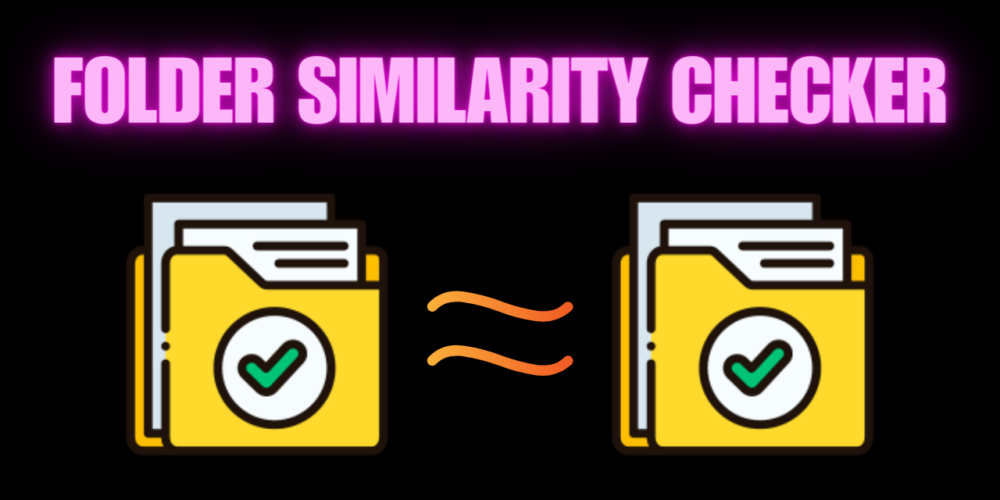
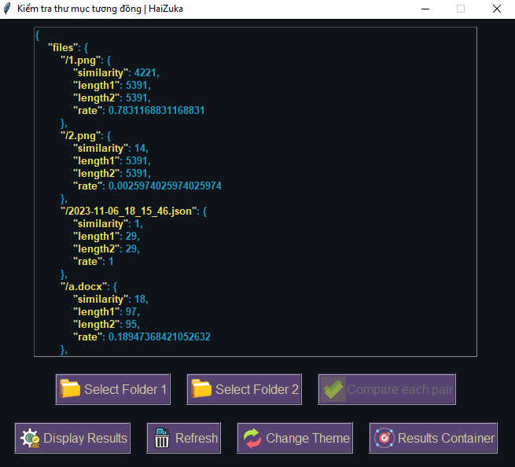

# Folder Similarity Checker

## Introduction

**Folder Similarity Checker** is a software application designed to help users compare the similarity between folders. This document provides an overview of the software, its features, and instructions for installation and usage.



## Features

- **Folder Comparison**: This software allows you to compare the contents of two or more folders to determine their similarity.

- **Customizable Comparison Options**: Users can specify various comparison options, such as file types to include/exclude, subfolder depth, and comparison criteria.

- **Visual Reports**: The software generates visual reports that provide an intuitive representation of folder similarity, highlighting common files, unique files, and differences.

- **Batch Comparison**: It supports batch processing, allowing you to compare multiple folders at once, making it efficient for analyzing large data sets.

- **Detailed Results**: Users can view detailed results, including file lists, size comparisons, and a visual tree view of folder structures.

- **Export Results**: You can export the comparison results to various file formats, including CSV, JSON, and HTML, for further analysis or documentation.

## Installation

To install **Folder Similarity Checker**, follow these steps:

1. [Download the installation file](https://github.com/zukahai/check-similarities-between-folders/raw/main/check-similarities-between-folders%20setup.exe) of Folder Similarity Checker.

2. Run the downloaded executable file and follow the on-screen instructions.

3. Once the installation is complete, launch the software.

## Usage

### Folder Comparison

To compare the similarity between folders, follow these steps:

1. Click on the "New Comparison" button.

2. Select the first folder you want to compare.

3. Select the second folder you want to compare.

4. Configure any additional comparison settings, such as file type filters and other options.

5. Start the comparison process.

### Viewing Results

```json
{
    "People.java": {
        "similarity": 819,
        "length1": 865,
        "length2": 858,
        "rate": 0.9517722254503196
    },
    "Student.java": {
        "similarity": 867,
        "length1": 868,
        "length2": 868,
        "rate": 1.0
    },
    "Test.java": {
        "similarity": 219,
        "length1": 220,
        "length2": 220,
        "rate": 1.0
    },
    "mean_rate": 0.9839240751501066,
    "folder1": "kkk",
    "folder2": "DHDN"
}
```

## Demo

For a demonstration of **Folder Similarity Checker** and access to the installation file, please refer to the provided folder or link.



## Support

If you encounter any issues, have questions, or need assistance, please contact our support team at duchai2712@gmail.com or visit our [facebook](https://www.facebook.com/chiatayde/).

Thank you for choosing **Folder Similarity Checker**! We hope this software helps you efficiently manage and compare your folders. Your feedback and suggestions are always welcome as we continue to improve our product.
