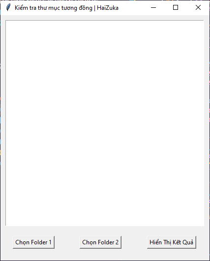
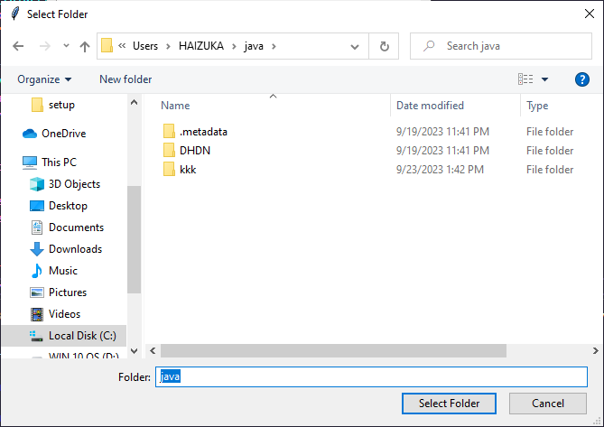
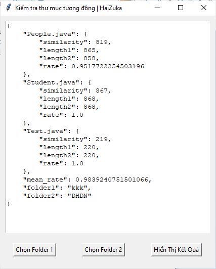

<div align="center">

# Kiểm tra tính tương đồng của 2 thư mục
</div>

### Kết quả dự kiến

```json
{
    "People.java": {
        "similarity": 819,
        "length1": 865,
        "length2": 858,
        "rate": 0.9517722254503196
    },
    "Student.java": {
        "similarity": 867,
        "length1": 868,
        "length2": 868,
        "rate": 1.0
    },
    "Test.java": {
        "similarity": 219,
        "length1": 220,
        "length2": 220,
        "rate": 1.0
    },
    "mean_rate": 0.9839240751501066,
    "folder1": "kkk",
    "folder2": "DHDN"
}
```

### Cách sử dụng

Tải [similary.zip](https://github.com/zukahai/check-similarities-between-folders/raw/main/similary.zip) và giải nén.

Chạy app.exe

Giao diện chính của app

<p align="center">  </p>

Chọn 2 folder

<p align="center">  </p>

Hiện thị kết quả:

<p align="center">  </p>